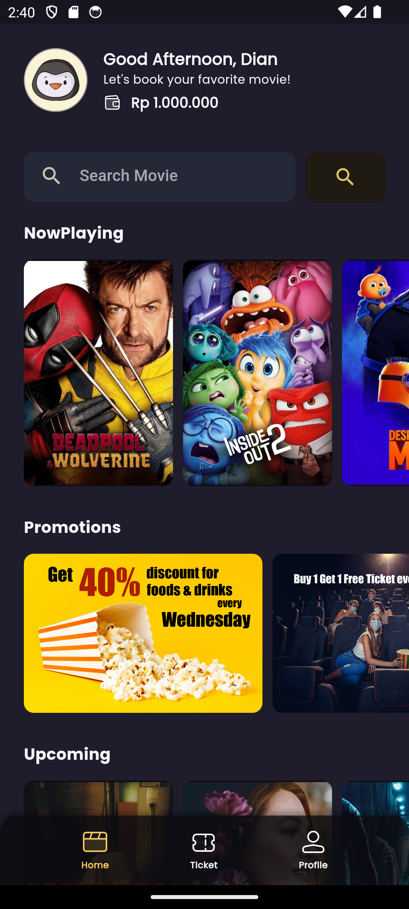
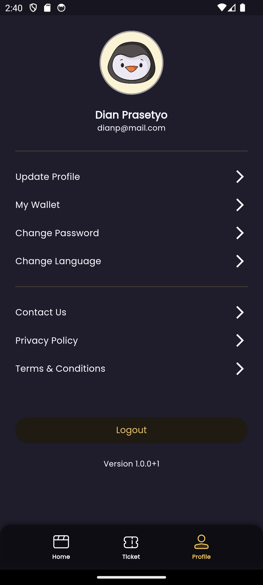
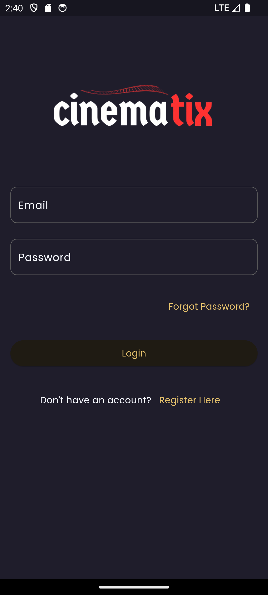
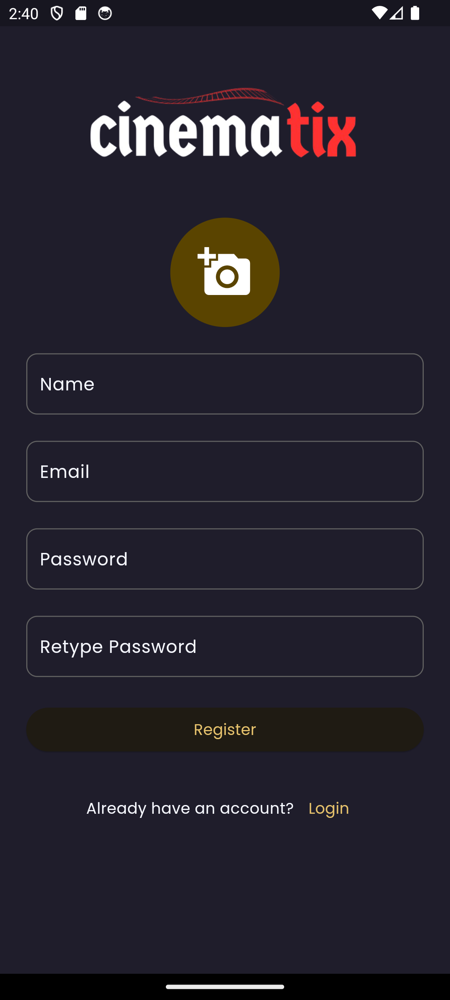

# cinematix

A movie ticket booking app that allows users to register, log in, view now-playing and upcoming movies, access detailed movie information, and book tickets for movie shows. Integrated TMDB (The Movie Database) API as the remote data source and used Firebase for authentication and user data storage.

Tech Stack: Dart, Flutter, Riverpod, Firebase.

## Features

| Feature  | Screenshoot                                         |
| -------- | --------------------------------------------------- |
| Home     |  |
| Profile  |  |
| Login    |  |
| Register |  |
